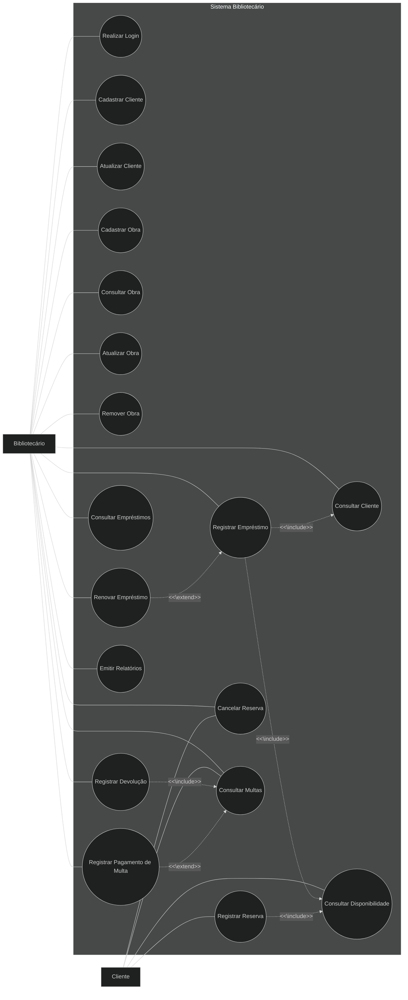

# Use case

o use case esta no formato mermaid

```mermaid
---
config:
  theme: dark
---
flowchart LR

    B[Bibliotecário]
    C[Cliente]

    subgraph SB["Sistema Bibliotecário"]

        UC1((Realizar Login))
        UC2((Cadastrar Cliente))
        UC3((Consultar Cliente))
        UC4((Atualizar Cliente))
        UC5((Cadastrar Obra))
        UC6((Consultar Obra))
        UC7((Atualizar Obra))
        UC8((Remover Obra))
        UC9((Registrar Empréstimo))
        UC10((Registrar Devolução))
        UC11((Renovar Empréstimo))
        UC12((Registrar Reserva))
        UC13((Cancelar Reserva))
        UC14((Consultar Disponibilidade))
        UC15((Consultar Empréstimos))
        UC16((Consultar Multas))
        UC17((Registrar Pagamento de Multa))
        UC18((Emitir Relatórios))

    end

    B --- UC1
    B --- UC2
    B --- UC3
    B --- UC4
    B --- UC5
    B --- UC6
    B --- UC7
    B --- UC8
    B --- UC9
    B --- UC10
    B --- UC11
    B --- UC13
    B --- UC15
    B --- UC16
    B --- UC17
    B --- UC18

    C --- UC12
    C --- UC13
    C --- UC14
    C --- UC16

    UC9 -. "<<\include>>" .-> UC14
    UC9 -. "<<\include>>" .-> UC3

    UC10 -. "<<\include>>" .-> UC16

    UC11 -. "<<\extend>>" .-> UC9

    UC12 -. "<<\include>>" .-> UC14

    UC17 -. "<<\extend>>" .-> UC16
```
