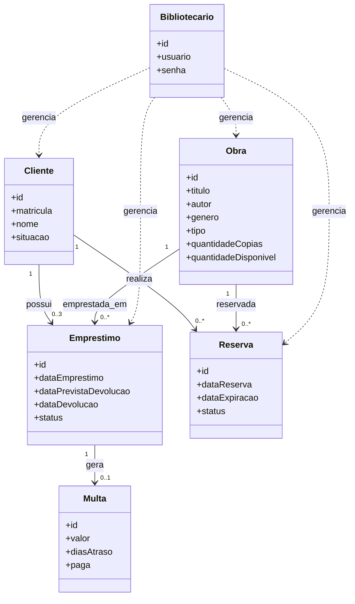
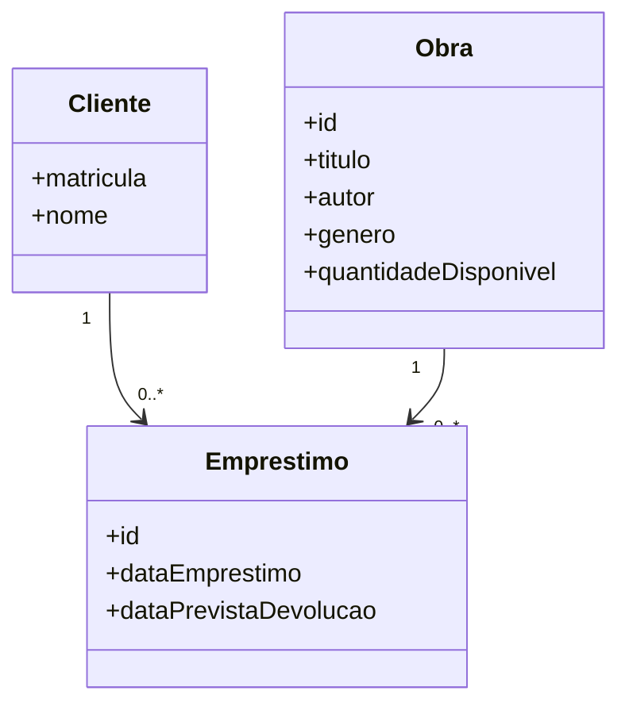

# Domain Model — Sistema Bibliotecário

> Modelo de domínio simplificado considerando todos os requisitos,
> regras de negócio, backlog e enunciado do desafio.

---

## Diagrama de Classes



---

## Entidades

### Cliente

Representa uma pessoa cadastrada na biblioteca.

Atributos:

```
id
matricula
nome
situacao
```

Regras:

```
situacao:
  REGULAR
  BLOQUEADO
```

---

### Obra

Representa um item do acervo. Pode ser livro ou revista.

Atributos:

```
id
titulo
autor
genero
tipo            (LIVRO | REVISTA)
quantidadeCopias
quantidadeDisponivel
```

Regras:

```
quantidadeDisponivel <= quantidadeCopias
```

---

### Emprestimo

Representa a retirada de uma obra por um cliente.

Atributos:

```
id
dataEmprestimo
dataPrevistaDevolucao
dataDevolucao
status
```

Regras:

```
status:
  ATIVO
  DEVOLVIDO
  ATRASADO
```

Relacionamentos:

```
1 Cliente
1 Obra
```

---

### Reserva

Representa a reserva de uma obra indisponível.

Atributos:

```
id
dataReserva
dataExpiracao
status
```

Regras:

```
status:
  ATIVA
  CANCELADA
  EXPIRADA
  CONCLUIDA
```

Relacionamentos:

```
1 Cliente
1 Obra
```

---

### Multa

Representa uma penalidade gerada por atraso na devolução.

Atributos:

```
id
valor
diasAtraso
paga
```

Relacionamento:

```
1 Emprestimo
```

---

### Bibliotecario

Usuário responsável pela operação do sistema.

Atributos:

```
id
usuario
senha
```

---

## Regras de Negócio

### RN01 — Prazo de Empréstimo

```
Prazo maximo: 7 dias
```

Impacta: `Emprestimo.dataPrevistaDevolucao`

---

### RN02 — Cálculo de Multa

```
R$ 1,00 por dia de atraso

Formula:
  valor = diasAtraso * 1.00
```

Impacta: `Multa.valor`

---

### RN03 — Prazo de Reserva

```
Prazo: 3 dias apos a disponibilidade
```

Impacta: `Reserva.dataExpiracao`

---

### RN04 — Bloqueio por Atraso

```
Cliente com emprestimo em atraso nao pode
realizar novo emprestimo.
```

Impacta: `Cliente.situacao`

---

### RN05 — Limite de Empréstimos

```
Maximo de 3 emprestimos ativos por cliente.
```

Impacta: `Cliente -> Emprestimos Ativos`

---

### RN06 — Cancelamento Automático de Reserva

```
Reserva e cancelada automaticamente
quando o emprestimo e realizado.
```

Impacta: `Reserva.status`

---

### RN07 — Remoção de Obras

```
Obras podem ser removidas quando
obsoletas ou danificadas.
```

Impacta: `Obra`

---

## Agregados

```
Cliente
├── Emprestimos
└── Reservas

Obra
├── Emprestimos
└── Reservas

Emprestimo
└── Multa
```

---

## Modelo MVP — Sprint 1

Escopo mínimo necessário para a primeira entrega:

```
Cliente
Obra
Emprestimo
```

Diagrama reduzido:



> Este modelo cobre integralmente o escopo final do projeto e pode ser
> reduzido para o MVP sem necessidade de refatoração posterior.
